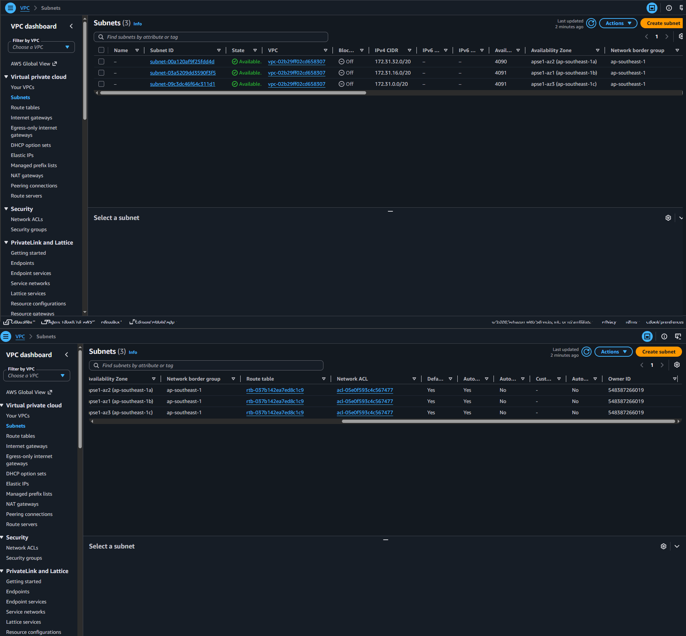
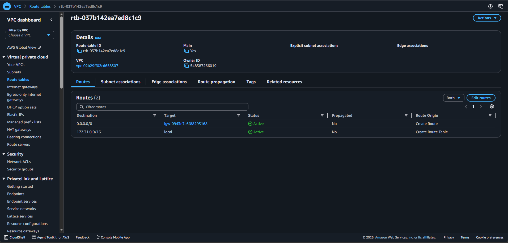
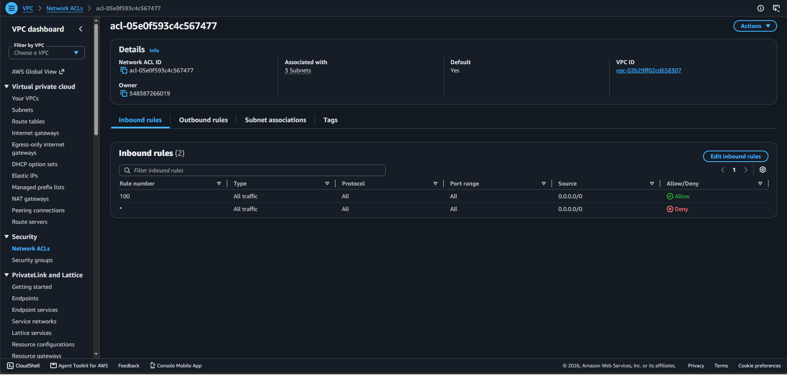
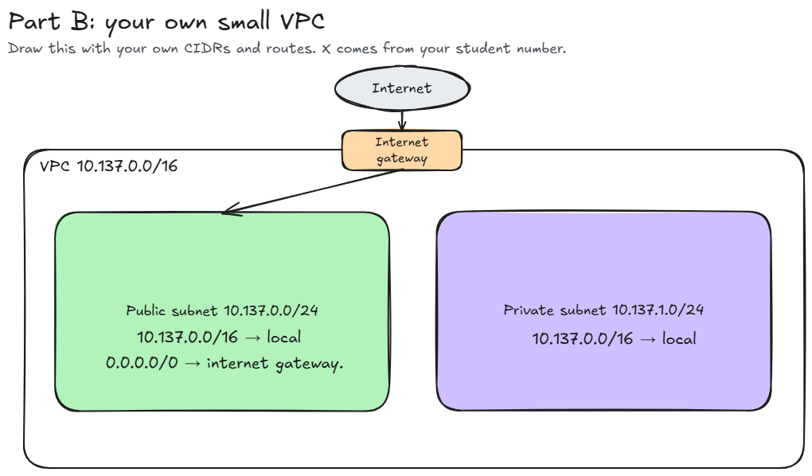

# Assignment 2 Submission

<!--
How to use this template:

1. Copy this file to submissions/assignment-2/<your-github-username>/submission.md
2. Replace every answer placeholder with your own answer. Delete the angle brackets too.
3. Save your four images in the same folder, with the exact file names below.
4. Do not write your full name or your student number in this file.
-->

## About me

- GitHub username: saintschalice
- Section: IV-ACSAD
- IAM user name that I signed in with: acsad-g01
- X: 137

---

## Part A. Explore

### A1. The VPC

Default VPC IPv4 CIDR:

172.31.0.0/16

Number of addresses in that CIDR:

65,536

### A2. The subnets

| Availability Zone | IPv4 CIDR      |
| ----------------- | -------------- |
| ap-southeast-1a   | 172.31.32.0/20 |
| ap-southeast-1b   | 172.31.16.0/20 |
| ap-southeast-1c   | 172.31.0.0/20  |

Screenshot 1. Save it as `screenshot-1-subnets.png` in your folder. The image line below shows it.

### A3. Available addresses

Available IPv4 addresses in each subnet:

- 172.31.16.0/20 (ap-southeast-1b): 4091
- 172.31.0.0/20 (ap-southeast-1c): 4091
- 172.31.32.0/20 (ap-southeast-1a): 4090

Why is the number lower than 4,096?

AWS reserves 5 addresses in every subnet (first four and the last one). 4,096 - 5 = 4,091.

What uses the missing address in the subnet with the lowest number?

The subnet in ap-southeast-1a shows 4,090 available addresses, one fewer than the other two. The missing address is used by the EC2 instance `umak-elec3-week3-demo` (`i-06e84beed97da3b70`), a t3.micro. It is in subnet `subnet-00a120af9f25fdd4d`, which is the 1a subnet. The instance is stopped, but a stopped instance still keeps its network interface and its address, so the address stays used.

### A4. The route table

| Destination   | Target  |
| ------------- | ------- |
| 0.0.0.0/0     | igw-... |
| 172.31.0.0/16 | local   |

Screenshot 2. Save it as `screenshot-2-routes.png` in your folder. The image line below shows it.

### A5. Public or private

Are the default subnets public or private? Which route proves it?

public. The route `0.0.0.0/0` to `igw-...` proves it (README section 9).

### A6. The internet gateway

State of the internet gateway:

Attached

What happens to the default subnets if the gateway is detached?

the 0.0.0.0/0 route would have no working target, so traffic between the internet and the instances stops in both directions. Traffic inside the VPC still works through the local route.

### A7. NAT gateways

Number of NAT gateways:

0

Can a server in a new private subnet download updates? Why?

No. It would need a NAT gateway in a public subnet and a route `0.0.0.0/0` to it, and the account has no NAT gateway.
### A8. The network ACL

| Rule number | Source    | Allow or Deny |
| ----------- | --------- | ------------- |
| 100         | 0.0.0.0/0 | Allow         |
| *           | 0.0.0.0/0 | Deny          |

How is a network ACL different from a security group?

It attaches to a subnet and not a resource, it has allow and deny rules, it is stateless, and it checks rules by number and stops at the first match.

Screenshot 3. Save it as `screenshot-3-network-acl.png` in your folder. The image line below shows it.

### A9. The default security group

Inbound rule (type and source):

All traffic; source is the security group itself (sg-... / default).

Which resources can send traffic to an instance that uses it?

Only resources that are in the same `default` security group. It is not open to the internet (0.0.0.0/0).

---

## Part B. Prepare

### B1. Plan two subnets

- Public subnet CIDR: 10.137.0.0/24
- Private subnet CIDR: 10.137.1.0/24

### B2. Route tables

Route table of the public subnet:

| Destination   | Target           |
| ------------- | ---------------- |
| 10.137.0.0/16 | local            |
| 0.0.0.0/0     | internet gateway |

Route table of the private subnet:

| Destination   | Target |
| ------------- | ------ |
| 10.137.0.0/16 | local  |

### B3. My VPC diagram

Tool used (Excalidraw, draw.io, Lucidchart, or paper):

Excalidraw

Save your diagram as `vpc-diagram.png` in your folder. The image line below shows it.

### B4. Predict a change

Can you still open the web page from your laptop? Why?

No. 0.0.0.0/0 to the internet gateway was the only route that carried internet traffic, so without it the traffic has no path.

Can the instance still reach another instance in the VPC? Why?

Yes. The local route `172.31.0.0/16` was not deleted, and it handles traffic inside the VPC.

### B5. Place a database

Which subnet gets the database? Why?

The private subnet (`10.137.1.0/24`), because it has no route to the internet gateway, so the internet cannot reach it (README section 9).

### B6. My question about VPCs

What is your question, and what made you think of it?

In the network ACL of the default VPC, rule 100 allows all traffic from `0.0.0.0/0`, and the `*` rule denies all traffic from `0.0.0.0/0`. The README says a network ACL checks rules from the lowest number and stops at the first match, so rule 100 wins. But if someone added a rule 50 that denies SSH (port 22) from `0.0.0.0/0`, would it override rule 100 for SSH traffic? Because network ACLs are stateless, would I also need to check the outbound rules for the replies?

I thought of this when I opened the Inbound rules tab and saw two rules with the same source, `0.0.0.0/0`, where one says Allow and the other says Deny. At first it looked like a conflict, and I wondered what would happen if more rules with different numbers were added.
